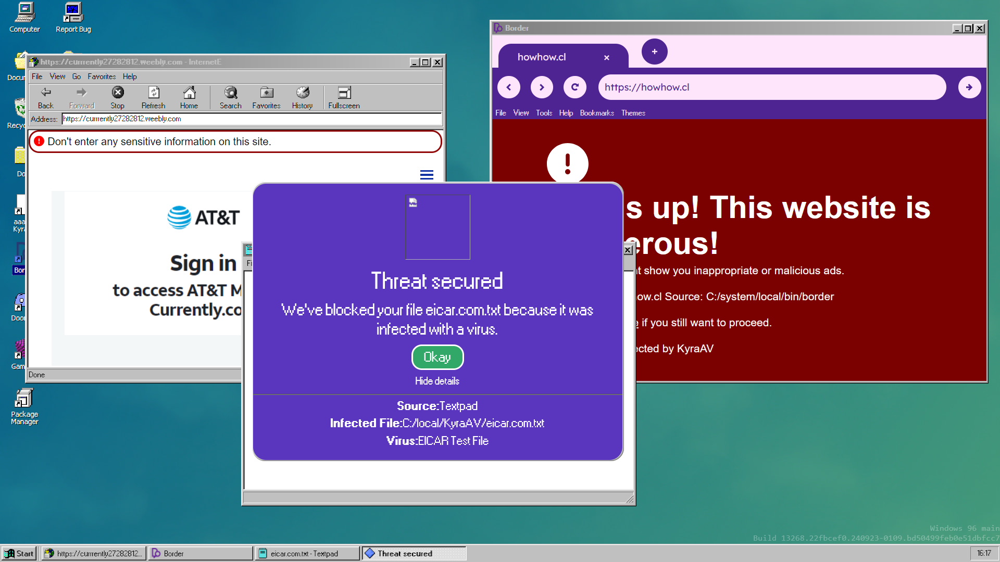

# KyraAV
KyraAV is an antivirus for Windows 96 v3 and above. It works pretty well and features automatic updates, self-defense, secure config, a virus shield, and a web shield. Plus, an optional Camera Shield! More features coming in the future. The appearance is designed to kinda resemble Avast! antivirus so it's familiar for people who have Avast!.

## Features
### Virus Shield
The Virus Shield scans viruses against all file read attempts. If a file is known malware, or contains a known malware sample, it blocks the app. It also tells you where the file read request came from - if the app is the in `apps.json` list, it'll show you the name of the file from there (only works on apps that are in the `C:/system/local/bin` folder).

### Web Shield
Web Shield blocks all HTTP requests to suspicious websites like ones that contain malware or adware, or websites that are scams or try to trick you into giving personal information. Web Shield also hooks into iframes to warn you about suspicious and scammy websites that you visit - and it even blocks JavaScript and websites that are thought to contain malware!

### Behavior Shield
Behavior Shield blocks known malware or known malware samples from being run directly in the WRT environment. That means even if we aren't aware of a domain yet, we can block an app from downloading and running a known virus from that website - keeping you safe. We also block attempts to change or remove KyraAV's source code, and attempts to mess with certain DOM objects or overwrite your operating system.

### Webcam Shield
Off by default, but you can enable it to only allow apps you want to be able to use your webcam. Webcam Shield doesn't apply to iframes.

## Changelog
### KyraAV v1.3
* Patched minor bugs in currently unused code (future-proofing)
* Introduced experimental UI dashboard (NOT INCLUDED!!!)

### KyraAV v1.2
* Bug fixes

### KyraAV v1.1
* Behavior Shield now blocks malicious code pasted into eval
* Framework for a UI is now in place (a UI is in the works)
* Web Shield can now block malicious websites in `<iframe>` tags
* New AT&T scams added to the list of deceptive sites.

### KyraAV v1.0
* Initial release!!

## Reporting Malware
You can report any malware or viruses using our Google Form.
https://forms.gle/n7VbXjVJHaKyc1uW8

By submitting, you agree to Google's privacy policy.

## KyraAV and Windows 96 v2sp2
> [!WARNING]
> KyraAV is NOT designed to run on Windows 96 v2. Bugs or glitches may occur, and we are not responsible for them.

> [!WARNING]
> KyraAV will NOT start on bootup and must be manually started by moving `kyra.js` to `C:/system/local/bin` and running `kyra.js` in the terminal on each boot.

KyraAV is not designed to run on Windows 96 v2sp2. However, I've created a compatibility layer that should allow some v3 apps to work fine on v2sp2 ([themirrazz/w96-v2v3-compat](https://github.com/themirrazz/w96-v2v3-compat/tree/main)). KyraAV seems to work okay here; however the installer will NOT run. Please use the file at `/src/manual-install.js` to install KyraAV on Windows 96 v2.

THIS SUPPORT IS EXPERIMENTAL AND SOME THINGS WILL BREAK. KYRA MAY NOT PROPERLY PROTECT AGAINST V2 APPS BECAUSE THEY DO NOT USE WRT. USE AT YOUR OWN RISK.
